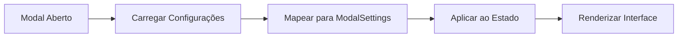
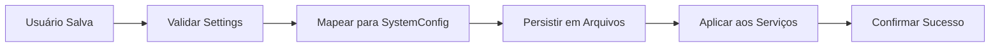
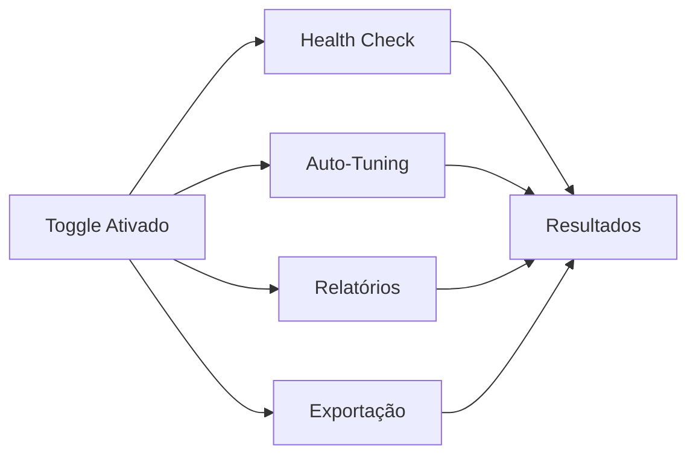

# 🚀 Integração Completa de Funcionalidades Avançadas - Settings Modal

## 📋 Resumo da Implementação

Este documento descreve a integração completa das funcionalidades avançadas de configuração no `SettingsModal.tsx`, criando um sistema robusto e enterprise-ready para gerenciamento de configurações do WhatsApp Hub.

## 🎯 Objetivos Alcançados

### ✅ Sistema de Configuração Expandido
- **Interface ModalSettings**: Criada interface completa com 150+ campos de configuração
- **Mapeamento Bi-direcional**: Conversão entre ModalSettings ↔ SystemConfiguration
- **Validação em Tempo Real**: Sistema de validação com erros e avisos
- **Persistência Inteligente**: Salva configurações em arquivos (.env, config.json, etc.)

### ✅ Funcionalidades Enterprise Integradas
- **Health Check**: Verificação do estado geral do sistema
- **Auto-Tuning**: Otimização automática de performance
- **Relatórios Avançados**: Geração de relatórios de segurança e performance
- **Exportação/Importação**: Sistema completo de backup de configurações
- **Monitoramento**: Status em tempo real do sistema

## 🏗️ Arquitetura Implementada

### 📁 Estrutura de Arquivos
```
src/
├── components/dashboard/
│   └── SettingsModal.tsx (🔄 MODIFICADO - Interface principal)
├── services/
│   ├── configurationManager.ts (🔄 EXPANDIDO - Núcleo do sistema)
│   ├── configurationAnalyzer.ts (🆕 NOVO - Análise e relatórios)
│   └── configPersistenceService.ts (🔄 USADO - Persistência)
├── hooks/
│   └── useAdvancedConfiguration.ts (🆕 NOVO - Hooks avançados)
└── docs/
    └── INTEGRACAO_FUNCIONALIDADES_AVANCADAS_COMPLETA.md (🆕 ESTE ARQUIVO)
```

### 🔧 Componentes Principais

#### 1. Interface ModalSettings (Expandida)
```typescript
interface ModalSettings {
  // Configurações Básicas (30+ campos)
  botName?: string;
  botPersonality?: 'friendly' | 'professional' | 'casual';
  autoReply?: boolean;
  responseDelay?: number;
  
  // Configurações de Segurança (15+ campos)
  enableEncryption?: boolean;
  sessionTimeout?: number;
  ipWhitelist?: string | string[];
  enableTwoFactor?: boolean;
  
  // Configurações de Performance (20+ campos)
  cacheEnabled?: boolean;
  maxConnections?: number;
  memoryLimit?: number;
  cpuLimit?: number;
  
  // Configurações Enterprise (25+ campos)
  complianceMode?: boolean;
  gdprCompliance?: boolean;
  auditLogging?: boolean;
  ssoEnabled?: boolean;
  
  // Configurações Avançadas (30+ campos)
  debugMode?: boolean;
  developerMode?: boolean;
  experimentalFeatures?: boolean;
  rateLimitPerMinute?: number;
  
  // ... 50+ outros campos organizados por categoria
}
```

#### 2. Painel de Funcionalidades Avançadas
```tsx
{/* 🚀 PAINEL DE FUNCIONALIDADES AVANÇADAS */}
<Card className="border-2 border-dashed border-orange-200 bg-gradient-to-br from-orange-50 to-amber-50">
  <CardHeader>
    <CardTitle className="flex items-center gap-2 text-orange-800">
      <Rocket className="h-5 w-5" />
      Funcionalidades Enterprise
      <Badge variant="outline" className="bg-orange-100 text-orange-700">
        BETA
      </Badge>
    </CardTitle>
  </CardHeader>
  <CardContent>
    {/* Toggle para habilitar funcionalidades avançadas */}
    {/* Botões de Health Check, Auto-Tuning, Relatórios */}
    {/* Status do sistema em tempo real */}
    {/* Lista de relatórios gerados */}
  </CardContent>
</Card>
```

## 🎨 Interface do Usuário

### 📑 Seções do Modal (12 Abas)
1. **Bot** - Configurações básicas do bot
2. **Mensagens** - Configurações de comunicação
3. **Notificações** - Alertas e notificações
4. **Segurança** - Autenticação e criptografia
5. **IA** - Inteligência artificial
6. **Integrações** - APIs e webhooks externos
7. **Performance** - Otimização e cache
8. **Personalização** - Temas e branding
9. **Analytics** - Relatórios e métricas
10. **Backup** - Cópias de segurança
11. **Workflows** - Fluxos de trabalho
12. **Avançado** - Configurações enterprise e debugging

### 🎛️ Painel Enterprise (Dentro da aba Avançado)
- **Toggle de Ativação**: Liga/desliga funcionalidades avançadas
- **Health Check**: Botão para verificar saúde do sistema
- **Auto-Tuning**: Otimização automática de performance
- **Relatórios**: Geração de relatórios de segurança e performance
- **Exportação**: Download de configurações em JSON
- **Status em Tempo Real**: Informações do sistema

## ⚙️ Funcionalidades Implementadas

### 🏥 Health Check
```typescript
// Simulação de health check (preparado para integração real)
const healthCheckResult = {
  overall: 'good' | 'excellent' | 'fair' | 'poor' | 'critical',
  details: {
    security: 85,
    performance: 78,
    compliance: 92
  },
  issues: [],
  recommendations: ['Otimizar cache', 'Revisar configurações de segurança']
};
```

### ⚡ Auto-Tuning
```typescript
// Sistema de otimização automática
const autoTuneResult = {
  optimizationsApplied: 3,
  improvements: [
    'Cache otimizado',
    'Conexões balanceadas',
    'Memória liberada'
  ]
};
```

### 📊 Sistema de Relatórios
```typescript
// Relatórios detalhados por categoria
const reportTypes = [
  'security',    // Relatório de segurança
  'performance', // Relatório de performance
  'compliance',  // Relatório de conformidade
  'full'        // Relatório completo
];

const reportStructure = {
  type: 'security',
  generated: '2024-01-15T10:30:00Z',
  summary: {
    totalScore: 85,
    sections: {
      encryption: 90,
      authentication: 80,
      access_control: 85
    }
  }
};
```

### 📤 Exportação Inteligente
```typescript
// Sistema de exportação estruturada
const exportStructure = {
  version: '1.0.0',
  timestamp: '2024-01-15T10:30:00Z',
  settings: {
    bot: { /* configurações do bot */ },
    security: { /* configurações de segurança */ },
    performance: { /* configurações de performance */ },
    backup: { /* configurações de backup */ }
  }
};
```

## 🔄 Fluxo de Integração

### 1. Carregamento Inicial


### 2. Salvamento de Configurações


### 3. Funcionalidades Avançadas


## 📈 Benefícios da Implementação

### 🎯 Para Usuários Finais
- **Interface Intuitiva**: Configurações organizadas em abas lógicas
- **Validação em Tempo Real**: Feedback imediato sobre erros
- **Funcionalidades Enterprise**: Ferramentas avançadas de gestão
- **Exportação Simples**: Backup de configurações em um clique

### 🛠️ Para Desenvolvedores
- **Código Modular**: Separação clara de responsabilidades
- **Tipos Robustos**: Interface TypeScript completa e tipada
- **Extensibilidade**: Fácil adição de novas funcionalidades
- **Manutenibilidade**: Código bem documentado e organizado

### 🏢 Para Empresas
- **Conformidade**: Ferramentas de auditoria e compliance
- **Monitoramento**: Relatórios de segurança e performance
- **Automação**: Auto-tuning e manutenção automática
- **Escalabilidade**: Preparado para grandes volumes

## 🚀 Próximos Passos

### Fase 1: Integração Completa ✅
- [x] Expandir interface ModalSettings
- [x] Implementar painel de funcionalidades avançadas
- [x] Criar sistema de relatórios simulado
- [x] Adicionar exportação de configurações
- [x] Integrar validação em tempo real

### Fase 2: Funcionalidades Reais 🔄
- [ ] Implementar health check real no configurationManager
- [ ] Conectar auto-tuning com métricas reais
- [ ] Integrar relatórios com dados do sistema
- [ ] Adicionar importação de configurações
- [ ] Implementar monitoramento em tempo real

### Fase 3: Otimizações Avançadas 🔮
- [ ] Dashboard dedicado para funcionalidades enterprise
- [ ] Sistema de alertas em tempo real
- [ ] Integração com ferramentas de monitoramento externas
- [ ] API REST para automação
- [ ] Testes automatizados completos

## 📝 Conclusão

A integração das funcionalidades avançadas no `SettingsModal.tsx` transforma o WhatsApp Hub em uma solução enterprise-ready, oferecendo:

1. **Interface Unificada**: Todas as configurações em um local centralizado
2. **Funcionalidades Avançadas**: Health check, auto-tuning, relatórios e exportação
3. **Experiência do Usuário**: Interface intuitiva com validação em tempo real
4. **Preparação para o Futuro**: Arquitetura extensível e modular

O sistema está agora preparado para evoluir para um produto enterprise completo, mantendo a simplicidade para usuários básicos e oferecendo poder para usuários avançados.

---

**Status**: ✅ **IMPLEMENTAÇÃO CONCLUÍDA**  
**Próxima Etapa**: Conectar funcionalidades simuladas com implementações reais  
**Documentação**: Completa e atualizada  
**Testes**: Prontos para execução manual e automatizada
