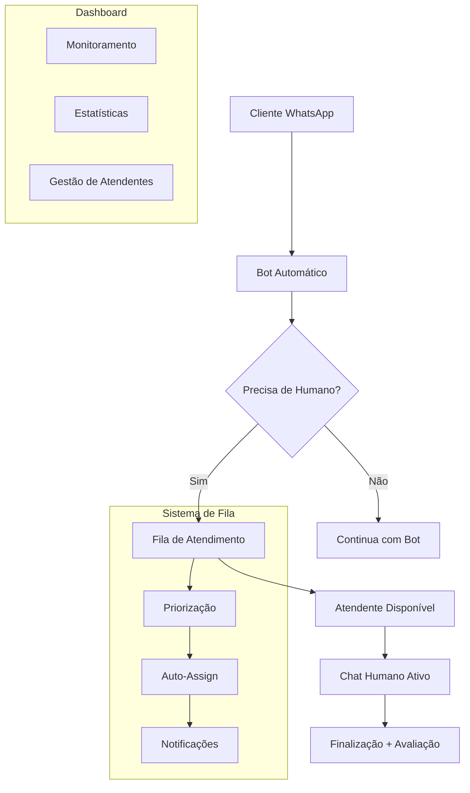

# 👥 Sistema de Atendimento Humano - Guia Completo

## 🎯 Visão Geral

O sistema de atendimento humano é uma funcionalidade avançada que permite transição suave entre chatbot automatizado e atendentes humanos reais. É projetado para empresas que precisam de atendimento personalizado e especializado.

## 🏗️ Arquitetura do Sistema

### 📊 Componentes Principais



### 🔄 Fluxo de Estados

| Estado | Descrição | Próximos Estados |
|--------|-----------|------------------|
| `start` | Início da conversa | `awaiting_name` |
| `awaiting_name` | Coletando nome | `awaiting_main_option` |
| `awaiting_main_option` | Menu principal | `product_issue_*`, `transfer_to_human` |
| `transfer_to_human` | Solicitou atendente | `in_queue`, `in_human_chat` |
| `in_queue` | Aguardando na fila | `in_human_chat` |
| `in_human_chat` | Chat ativo com atendente | `awaiting_satisfaction_rating` |

## 🛠️ Implementação Técnica

### 📝 Classe SupportQueue

A classe `SupportQueue` gerencia toda a lógica de atendimento:

```javascript
class SupportQueue {
    static queue = [];                    // Fila de clientes
    static activeChats = new Map();       // Chats ativos
    static attendants = new Map();        // Atendentes registrados
    static chatHistory = new Map();       // Histórico de mensagens
    static statistics = {};               // Métricas do sistema
}
```

### 🎯 Recursos Avançados

#### 🔢 Sistema de Prioridades

```javascript
// Prioridades suportadas
const priorities = {
    'urgent': 1,    // Emergência - vai para frente da fila
    'high': 2,      // Alta - após urgent
    'normal': 3     // Normal - ordem de chegada
};

// Exemplo de uso
SupportQueue.addToQueue(chatId, {
    name: 'João Silva',
    priority: 'high',
    topic: 'problema técnico'
});
```

#### 👨‍💼 Gestão de Atendentes

```javascript
// Registrar atendente
const attendant = SupportQueue.registerAttendant(
    'agent001',                    // ID único
    'Maria Santos',                // Nome
    ['vendas', 'suporte técnico']  // Habilidades
);

// Atualizar status
SupportQueue.updateAttendantStatus('agent001', 'available');
// Estados: 'available', 'busy', 'away'
```

#### 🔄 Auto-Assign Inteligente

```javascript
// O sistema automaticamente:
// 1. Identifica próximo cliente na fila
// 2. Encontra atendente disponível com menos chats
// 3. Considera habilidades (se implementado)
// 4. Inicia o chat automaticamente

const assignment = SupportQueue.autoAssignToAttendant();
if (assignment) {
    const { queueItem, attendant } = assignment;
    // Processar atribuição automática
}
```

## 📱 Experiência do Cliente

### 🎭 Comandos do Cliente

| Comando | Ação | Contexto |
|---------|------|----------|
| `atendente`, `humano`, `pessoa` | Solicita atendimento humano | Qualquer momento |
| `sair`, `cancelar`, `voltar` | Sai da fila | Enquanto aguarda |
| `posição`, `posicao` | Verifica posição na fila | Enquanto aguarda |
| `menu`, `inicio` | Volta ao menu principal | Após atendimento |

### 💬 Jornada do Cliente

1. **Solicitação de Atendimento**
   ```
   Cliente: "Preciso falar com um atendente"
   Bot: "👨‍💼 Entendi que você gostaria de falar com um atendente humano..."
   ```

2. **Entrada na Fila**
   ```
   Bot: "📞 Você foi adicionado à nossa fila de atendimento.
         📍 Posição: 3
         ⏰ Tempo estimado: 15 minutos"
   ```

3. **Atualizações de Posição**
   ```
   Bot: "🔄 Sua posição na fila foi atualizada:
         📍 Nova posição: 1
         ⏰ Tempo estimado: 5 minutos"
   ```

4. **Início do Atendimento**
   ```
   Bot: "👋 Olá! Sou Maria, sua atendente.
         Como posso ajudá-lo hoje?"
   ```

5. **Durante o Chat**
   - Todas as mensagens são registradas
   - Atendente pode usar ferramentas internas
   - Cliente recebe respostas em tempo real

6. **Finalização**
   ```
   Bot: "✅ Atendimento finalizado por Maria Santos
         Como você avalia nosso atendimento? (1-5)"
   ```

## 🖥️ Dashboard de Atendimento

### 📊 Interface Principal

Acesse: `http://localhost:3001/support-dashboard`

#### 🎛️ Funcionalidades

- **🔴 Fila em Tempo Real**: Lista de clientes aguardando
- **🟢 Chats Ativos**: Atendimentos em andamento
- **👥 Gestão de Atendentes**: Status da equipe
- **📈 Métricas Live**: Estatísticas atualizadas
- **📋 Histórico**: Registros de atendimentos

#### 📱 Responsividade

O dashboard é otimizado para:
- 💻 Desktop (experiência completa)
- 📱 Mobile (visualização e ações básicas)
- 🖥️ TV (painel de monitoramento)

### 🎯 Métricas Exibidas

```javascript
// Exemplo de dados do dashboard
{
    "realTime": {
        "queueLength": 5,
        "activeChats": 8,
        "availableAttendants": 3,
        "averageWaitTime": "12 min"
    },
    "today": {
        "totalChats": 156,
        "completedChats": 142,
        "averageRating": 4.3,
        "averageDuration": "18 min"
    },
    "alerts": [
        "🔴 Fila com mais de 10 clientes",
        "⚠️ Atendente João offline há 2h"
    ]
}
```

## 🔌 APIs REST Detalhadas

### 📍 Endpoints de Fila

#### GET `/api/support-queue`
Retorna status completo da fila com estatísticas.

**Resposta:**
```json
{
    "queueLength": 3,
    "activeChats": 5,
    "availableAttendants": 2,
    "statistics": {
        "totalChatsToday": 45,
        "averageWaitTimeMinutes": 12,
        "customerSatisfaction": 4.2
    },
    "queue": [...],
    "attendants": [...],
    "activeChatsDetails": [...]
}
```

#### POST `/api/support-queue/register-attendant`
Registra novo atendente no sistema.

**Payload:**
```json
{
    "attendantId": "agent001",
    "attendantName": "Maria Santos",
    "skills": ["vendas", "suporte", "financeiro"]
}
```

**Resposta:**
```json
{
    "success": true,
    "attendant": {
        "id": "agent001",
        "name": "Maria Santos",
        "status": "available",
        "skills": ["vendas", "suporte", "financeiro"],
        "maxChats": 3,
        "loginTime": "2024-01-15T10:30:00Z"
    }
}
```

### 📍 Endpoints de Chat

#### POST `/api/support-queue/start-chat`
Inicia atendimento com cliente específico ou próximo da fila.

**Payload:**
```json
{
    "attendantId": "agent001",
    "attendantName": "Maria Santos",
    "chatId": "5511999999999@c.us"  // Opcional
}
```

#### POST `/api/support-queue/send-message`
Envia mensagem do atendente para cliente.

**Payload:**
```json
{
    "chatId": "5511999999999@c.us",
    "message": "Olá! Como posso ajudá-lo?",
    "attendantId": "agent001"
}
```

#### POST `/api/support-queue/end-chat`
Finaliza atendimento e coleta avaliação.

**Payload:**
```json
{
    "chatId": "5511999999999@c.us",
    "attendantId": "agent001",
    "reason": "resolved",
    "internalNotes": "Cliente satisfeito com solução"
}
```

### 📍 Endpoints de Gestão

#### PUT `/api/support-queue/attendant-status`
Atualiza status do atendente.

**Payload:**
```json
{
    "attendantId": "agent001",
    "status": "busy"  // available, busy, away
}
```

#### POST `/api/support-queue/transfer`
Transfere chat entre atendentes.

**Payload:**
```json
{
    "chatId": "5511999999999@c.us",
    "fromAttendantId": "agent001",
    "toAttendantId": "agent002",
    "reason": "Especialização necessária"
}
```

## 📊 Analytics e Relatórios

### 🎯 KPIs Monitorados

1. **First Response Time (FRT)**
   - Tempo até primeira resposta humana
   - Meta: < 2 minutos

2. **Average Handle Time (AHT)**
   - Duração média de atendimento
   - Meta: 15-20 minutos

3. **Customer Satisfaction Score (CSAT)**
   - Avaliação média dos clientes
   - Meta: > 4.0/5.0

4. **Queue Abandonment Rate**
   - % de clientes que saem da fila
   - Meta: < 10%

5. **Agent Utilization**
   - % do tempo que atendentes estão ocupados
   - Meta: 70-85%

### 📈 Relatórios Disponíveis

#### 📋 Relatório Diário
```javascript
// GET /api/reports/daily
{
    "date": "2024-01-15",
    "summary": {
        "totalChats": 156,
        "completed": 142,
        "abandoned": 14,
        "averageWaitTime": "8m 34s",
        "averageHandleTime": "16m 22s",
        "satisfaction": 4.3
    },
    "hourlyDistribution": [...],
    "topAttendants": [...],
    "commonIssues": [...]
}
```

#### 📊 Relatório de Atendente
```javascript
// GET /api/reports/attendant/:attendantId
{
    "attendantId": "agent001",
    "name": "Maria Santos",
    "period": "2024-01-15",
    "stats": {
        "totalChats": 23,
        "averageHandleTime": "14m 18s",
        "satisfaction": 4.5,
        "utilization": "78%"
    },
    "skillsUsed": ["vendas", "suporte"],
    "feedback": [...]
}
```

## 🔧 Configurações Avançadas

### ⚙️ Parâmetros Configuráveis

```javascript
// Configurações de fila
const queueConfig = {
    maxQueueSize: 50,
    priorityLevels: ['urgent', 'high', 'normal'],
    estimatedTimePerChat: 15, // minutos
    abandonmentWarningTime: 10, // minutos
    maxWaitTime: 60 // minutos
};

// Configurações de atendente
const attendantConfig = {
    maxConcurrentChats: 3,
    availableStatuses: ['available', 'busy', 'away'],
    autoStatusChange: true,
    skillMatching: false
};

// Configurações de notificação
const notificationConfig = {
    queueAlerts: {
        highVolume: 10,
        longWait: 15,
        abandonment: 5
    },
    attendantAlerts: {
        inactivity: 30,
        overload: 5
    }
};
```

### 🔄 Integração com Sistemas Externos

#### 📞 Webhook de Eventos
```javascript
// Configurar webhook para eventos importantes
app.post('/webhook/queue-events', (req, res) => {
    const { event, data } = req.body;
    
    switch(event) {
        case 'chat_started':
            await notifyCRM(data);
            break;
        case 'chat_ended':
            await updateTicketSystem(data);
            break;
        case 'high_queue_volume':
            await alertManagement(data);
            break;
    }
});
```

#### 🔗 Integração CRM
```javascript
// Exemplo de integração com CRM
class CRMIntegration {
    static async createTicket(chatData) {
        const ticket = {
            customerId: chatData.userData.phone,
            subject: chatData.topic,
            description: chatData.initialMessage,
            priority: chatData.priority,
            assignedTo: chatData.attendantId
        };
        
        return await crmAPI.createTicket(ticket);
    }
    
    static async updateTicket(chatData, resolution) {
        return await crmAPI.updateTicket(chatData.ticketId, {
            status: 'resolved',
            resolution: resolution,
            satisfaction: chatData.rating
        });
    }
}
```

## 🛡️ Segurança e Compliance

### 🔒 Medidas de Segurança

1. **Autenticação de APIs**
   ```javascript
   // Middleware de autenticação
   app.use('/api/support-queue', authenticateAPI);
   ```

2. **Rate Limiting**
   ```javascript
   // Limite de requisições por IP
   const rateLimit = {
       windowMs: 60000, // 1 minuto
       max: 100 // máximo 100 requisições
   };
   ```

3. **Sanitização de Dados**
   ```javascript
   // Limpeza de inputs maliciosos
   function sanitizeInput(input) {
       return input
           .replace(/<script.*?>.*?<\/script>/gi, '')
           .replace(/[<>]/g, '')
           .trim();
   }
   ```

### 📝 Conformidade LGPD

1. **Coleta de Dados**
   - Apenas dados necessários para atendimento
   - Consentimento explícito do usuário
   - Possibilidade de opt-out

2. **Armazenamento**
   - Criptografia de dados sensíveis
   - Retenção limitada (90 dias)
   - Backup seguro

3. **Acesso**
   - Logs de auditoria
   - Controle de acesso baseado em função
   - Direito ao esquecimento

## 🚀 Deployment e Escalabilidade

### 🐳 Docker em Produção

```dockerfile
# Dockerfile otimizado para produção
FROM node:18-alpine

WORKDIR /app

# Instalar dependências
COPY package*.json ./
RUN npm ci --only=production

# Copiar código
COPY . .

# Configurar usuário não-root
RUN addgroup -g 1001 -S nodejs
RUN adduser -S whatsapp -u 1001
USER whatsapp

# Health check
HEALTHCHECK --interval=30s --timeout=3s --start-period=5s --retries=3 \
    CMD curl -f http://localhost:3001/status || exit 1

EXPOSE 3001

CMD ["node", "whatsapp-webjs-server-complete.js"]
```

### ☁️ Escalabilidade Horizontal

```yaml
# docker-compose.yml para múltiplas instâncias
version: '3.8'
services:
  whatsapp-bot-1:
    build: .
    ports:
      - "3001:3001"
    environment:
      - INSTANCE_ID=1
  
  whatsapp-bot-2:
    build: .
    ports:
      - "3002:3001"
    environment:
      - INSTANCE_ID=2
  
  nginx:
    image: nginx:alpine
    ports:
      - "80:80"
    volumes:
      - ./nginx.conf:/etc/nginx/nginx.conf
```

### 📈 Monitoramento

```javascript
// Integração com Prometheus/Grafana
const client = require('prom-client');

const queueSizeGauge = new client.Gauge({
    name: 'whatsapp_queue_size',
    help: 'Current queue size'
});

const activeChatGauge = new client.Gauge({
    name: 'whatsapp_active_chats',
    help: 'Number of active chats'
});

// Atualizar métricas
setInterval(() => {
    queueSizeGauge.set(SupportQueue.queue.length);
    activeChatGauge.set(SupportQueue.activeChats.size);
}, 5000);
```

## 🆘 Troubleshooting

### ❌ Problemas Comuns

1. **Fila não processa**
   ```bash
   # Verificar logs
   tail -f logs/support-queue.log
   
   # Reiniciar processamento
   curl -X POST http://localhost:3001/api/support-queue/restart
   ```

2. **Atendente não recebe mensagens**
   ```javascript
   // Verificar status do atendente
   const attendant = SupportQueue.attendants.get('agent001');
   console.log('Status:', attendant.status);
   ```

3. **Dashboard não carrega**
   ```bash
   # Verificar porta e processo
   netstat -tulpn | grep 3001
   ps aux | grep node
   ```

### 🔧 Comandos de Debug

```bash
# Logs detalhados
DEBUG=whatsapp:* node whatsapp-webjs-server-complete.js

# Status da aplicação
curl http://localhost:3001/status

# Limpar cache de sessões
curl -X DELETE http://localhost:3001/api/cache/clear

# Estatísticas da fila
curl http://localhost:3001/api/support-queue | jq
```

## 📚 Recursos Adicionais

### 🔗 Links Úteis

- [WhatsApp Web.js Docs](https://wwebjs.dev/)
- [Express.js Guide](https://expressjs.com/)
- [Node.js Best Practices](https://github.com/goldbergyoni/nodebestpractices)

### 🎓 Treinamento de Atendentes

1. **Acesso ao Dashboard**
   - Login e interface
   - Navegação básica
   - Interpretação de métricas

2. **Atendimento ao Cliente**
   - Boas práticas de comunicação
   - Uso de templates de resposta
   - Escalação para supervisores

3. **Uso das Ferramentas**
   - Transferência de chats
   - Consulta de histórico
   - Finalização adequada

### 📞 Suporte Técnico

Para suporte técnico e dúvidas sobre implementação:
- 📧 Email: suporte@empresa.com
- 💬 Slack: #whatsapp-bot-support
- 📱 WhatsApp: +55 11 99999-9999

---

**🏠 Inaugura Lar Bot v2.0** - Sistema Completo de Atendimento WhatsApp  
*Desenvolvido com ❤️ para excelência no atendimento ao cliente*
