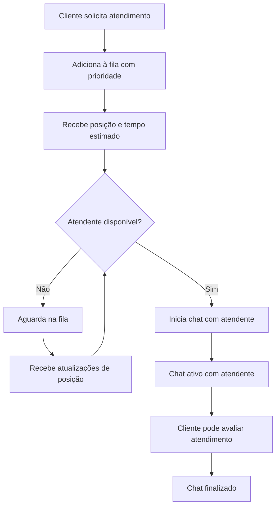

<div align="center">

# 🤖 WhatsApp Web.js + n8n Chatbot


**Sistema completo e avançado para criar chatbots WhatsApp inteligentes**  
*Processamento de texto, áudio, imagem, vídeo com IA de última geração*

[🚀 Início Rápido](#-início-rápido) • [📖 Documentação](#-instalação-completa) • [🎯 Exemplos](#-exemplos-práticos) • [🆘 Suporte](#-suporte)

---

### ⭐ **Principais Características**

</div>

<table align="center">
<tr>
<td align="center">🧠<br><b>IA Avançada</b><br>GPT-4, Whisper, Vision</td>
<td align="center">💬<br><b>Multi-mídia</b><br>Texto, Áudio, Imagem, Vídeo</td>
<td align="center">🔄<br><b>Tempo Real</b><br>Respostas instantâneas</td>
<td align="center">🆓<br><b>Gratuito</b><br>Sem custos de API</td>
</tr>
</table>

## 🌟 Funcionalidades Completas

### 🎯 **Sistema de Atendimento Avançado**

| Funcionalidade | Descrição | Status |
|---------------|-----------|--------|
| 🤖 **Bot Inteligente** | Fluxos conversacionais automatizados | ✅ Pronto |
| 👥 **Atendimento Humano** | Fila de atendimento com múltiplos atendentes | ✅ Pronto |
| 📊 **Dashboard** | Monitoramento em tempo real da fila e chats | ✅ Pronto |
| 🔄 **APIs REST** | Controle completo via API | ✅ Pronto |
| 📈 **Analytics** | Métricas e estatísticas detalhadas | ✅ Pronto |
| 💾 **Persistência** | Estados salvos com backup automático | ✅ Pronto |

### 🎯 **Processamento Inteligente de Mídia**

| Tipo de Mensagem | Capacidade | Tecnologia | Status |
|------------------|------------|------------|--------|
| 💬 **Texto** | Conversação natural com IA | GPT-4 Turbo | ✅ Pronto |
| 🎵 **Áudio/Voz** | Transcrição em tempo real | OpenAI Whisper | ✅ Pronto |
| 🖼️ **Imagens** | Análise visual e OCR | GPT-4 Vision | ✅ Pronto |
| 🎬 **Vídeos** | Extração de frames e análise | Custom AI Pipeline | ✅ Pronto |
| 📄 **Documentos** | Extração e resumo de texto | OCR + GPT-4 | ✅ Pronto |
| 📍 **Localização** | Processamento de coordenadas | Maps API | 🔧 Configurável |

### 🧠 **Recursos de IA Avançados**

#### 🎭 **Personalidades do Bot**
- 🤖 **Assistente Técnico**: Suporte especializado
- 👥 **Atendimento**: Foco em customer service
- 🎓 **Educativo**: Explicações didáticas
- 😄 **Casual**: Conversação descontraída
- 💼 **Profissional**: Comunicação corporativa

#### 🛠️ **Ferramentas Integradas**
- 📚 **Wikipedia**: Consultas enciclopédicas
- 🌐 **Web Search**: Busca em tempo real
- 📊 **Calculadora**: Operações matemáticas
- 🌤️ **Clima**: Previsão meteorológica
- 📈 **Cotações**: Preços de ações e crypto
- 🗓️ **Agenda**: Gerenciamento de eventos

### 💡 **Recursos Técnicos**

#### 🔄 **Sistema de Memória**
```
┌─ Conversa Individual ─┐    ┌─ Contexto Global ─┐    ┌─ Aprendizado ─┐
│ • Histórico pessoal   │    │ • Preferências    │    │ • Padrões     │
│ • Preferências        │ ←→ │ • Configurações   │ ←→ │ • Melhorias   │
│ • Estado da conversa  │    │ • Dados do usuário│    │ • Adaptação   │
└──────────────────────┘    └──────────────────┘    └───────────────┘
```

#### 🔗 **Arquitetura do Sistema**
```
📱 WhatsApp ←→ 🔄 Web.js ←→ 🌐 Webhook ←→ 📊 n8n ←→ 🤖 IA ←→ 📤 Resposta
     ↑                                                        ↓
📊 Analytics ←→ 💾 Database ←→ 🧠 Memory ←→ 🛠️ Tools ←→ 📈 Metrics
```

## 📋 Pré-requisitos

- Node.js 16+ 
- n8n instalado e rodando
- Conta OpenAI (para IA e transcrição)
- WhatsApp pessoal (para escaneamento do QR Code)

## 🔧 Instalação

### 1. Clone e Configure o Servidor WhatsApp

```bash
# Clone ou baixe os arquivos
cd whats-hub

# Instale as dependências
npm install whatsapp-web.js express qrcode axios

# Configure as variáveis de ambiente (opcional)
export N8N_WEBHOOK_URL="http://localhost:5678/webhook/whatsapp-messages"
export PORT=3001
```

### 2. Configure o n8n

1. **Importe o Template**:
   - Abra o n8n
   - Vá em "Templates" ou "Import"
   - Importe o arquivo `template-whatsapp-webjs.json`

2. **Configure as Credenciais**:
   - **OpenAI API**: Adicione sua chave da OpenAI para transcrição e IA
   - **Webhook URL**: Certifique-se que está apontando para o servidor

3. **Ative o Workflow**:
   - Ative o workflow no n8n
   - Anote a URL do webhook gerada

### 3. Inicie o Servidor

```bash
# Inicie o servidor WhatsApp
node whatsapp-webjs-server.js

# Ou use nodemon para desenvolvimento
npm install -g nodemon
nodemon whatsapp-webjs-server.js
```

### 4. Conecte o WhatsApp

1. Acesse `http://localhost:3001/qr`
2. Escaneie o QR Code com seu WhatsApp
3. Aguarde a confirmação de conexão

## 📱 Como Usar

### Enviar Mensagens de Teste

Após conectar, envie mensagens para o WhatsApp conectado:

- **Texto**: "Olá, como você está?"
- **Áudio**: Grave uma nota de voz
- **Imagem**: Envie uma foto
- **Vídeo**: Envie um vídeo curto

O bot responderá automaticamente usando IA!

### Endpoints da API

```bash
# Status do servidor
GET http://localhost:3001/status

# Ver QR Code
GET http://localhost:3001/qr

# Enviar mensagem programaticamente
POST http://localhost:3001/api/send-message
{
  "chatId": "5511999999999@c.us",
  "message": "Olá! Como posso ajudar?"
}

# Enviar mídia
POST http://localhost:3001/api/send-media
{
  "chatId": "5511999999999@c.us",
  "media": {
    "mimetype": "image/jpeg",
    "data": "base64_data_here",
    "filename": "image.jpg"
  },
  "caption": "Legenda da imagem"
}
```

## 🎯 Fluxo de Funcionamento

```
📱 WhatsApp → 🔄 WhatsApp Web.js → 🌐 Webhook → 📊 n8n → 🤖 IA → 📤 Resposta
```

1. **Mensagem Recebida**: WhatsApp Web.js captura a mensagem
2. **Processamento**: Servidor processa e envia para n8n via webhook
3. **Análise**: n8n analisa o tipo de mensagem (texto, áudio, imagem, vídeo)
4. **IA**: Processa com OpenAI/GPT-4 conforme o tipo
5. **Resposta**: n8n gera resposta inteligente
6. **Envio**: Resposta é enviada de volta via WhatsApp Web.js

## 🔧 Configurações Avançadas

### Variáveis de Ambiente

```bash
# URL do webhook do n8n
N8N_WEBHOOK_URL=http://localhost:5678/webhook/whatsapp-messages

# Porta do servidor
PORT=3001

# Chaves da API (configure no n8n)
OPENAI_API_KEY=sk-...
```

### Personalização do Bot

Edite o workflow n8n para:

- ✏️ Mudar personalidade do bot
- 🔧 Adicionar novas ferramentas/APIs  
- 🎨 Customizar respostas
- 📊 Adicionar analytics
- 🔒 Implementar autenticação

### Tipos de Mensagem Suportados

| Tipo | Processamento | IA Usada |
|------|---------------|----------|
| **Texto** | Direto | GPT-4 |
| **Áudio** | Transcrição → Texto | Whisper + GPT-4 |
| **Imagem** | Análise visual | GPT-4 Vision |
| **Vídeo** | Análise de frames | Customizável |
| **Documento** | Extração de texto | OCR + GPT-4 |

## 🐳 Docker (Opcional)

```dockerfile
FROM node:18-alpine

WORKDIR /app
COPY package*.json ./
RUN npm install

COPY . .

EXPOSE 3001
CMD ["node", "whatsapp-webjs-server.js"]
```

```bash
# Construir imagem
docker build -t whatsapp-webjs-server .

# Executar
docker run -p 3001:3001 -e N8N_WEBHOOK_URL="http://host.docker.internal:5678/webhook/whatsapp-messages" whatsapp-webjs-server
```

## 🔍 Monitoramento

### Logs do Servidor
```bash
# Ver logs em tempo real
tail -f server.log

# Status via API
curl http://localhost:3001/status
```

### Logs do n8n
- Acesse a interface do n8n
- Vá em "Executions" para ver o histórico
- Monitore erros e performance

## ⚠️ Considerações Importantes

### Limitações do WhatsApp Web.js
- ⚠️ **Detecção**: WhatsApp pode detectar o uso de bots
- 🔄 **Reconexão**: Pode desconectar e precisar de nova autenticação
- 📱 **Dependência**: Precisa manter o telefone conectado

### Para Uso Profissional
- 🏢 **WhatsApp Business API**: Considere migrar para a API oficial
- 🔒 **Compliance**: Verifique termos de uso do WhatsApp
- 📈 **Escalabilidade**: Para alto volume, use soluções dedicadas

### Segurança
- 🔐 **Credenciais**: Nunca commite chaves de API
- 🌐 **HTTPS**: Use HTTPS em produção
- 🔒 **Firewall**: Proteja endpoints sensíveis

## 🐛 Solução de Problemas

### QR Code não aparece
```bash
# Deletar sessão anterior
rm -rf .wwebjs_auth/

# Reiniciar servidor
node whatsapp-webjs-server.js
```

### Mensagens não chegam no n8n
1. Verifique se o n8n está rodando
2. Confirme a URL do webhook
3. Teste o endpoint manualmente:
```bash
curl -X POST http://localhost:5678/webhook/whatsapp-messages \
  -H "Content-Type: application/json" \
  -d '{"test": "message"}'
```

### Erro de transcrição de áudio
- Verifique a chave da OpenAI no n8n
- Confirme se o áudio está no formato correto
- Teste com áudios menores primeiro

### Performance lenta
- Aumente a memória do Node.js: `node --max-old-space-size=4096`
- Use SSD para melhor I/O
- Configure cache no n8n

## 📚 Recursos Adicionais

- [Documentação WhatsApp Web.js](https://wwebjs.dev/)
- [Documentação n8n](https://docs.n8n.io/)
- [OpenAI API Docs](https://platform.openai.com/docs)
- [Exemplos de Templates](https://n8n.io/workflows/)

## 🤝 Contribuição

Sinta-se livre para contribuir com melhorias:

1. Fork o projeto
2. Crie uma branch para sua feature
3. Commit suas mudanças
4. Abra um Pull Request

## 📄 Licença

MIT License - veja o arquivo LICENSE para detalhes.

---

**💡 Dica**: Comece com mensagens simples e vá adicionando complexidade gradualmente. O sistema é muito flexível e pode ser adaptado para diversos casos de uso!

**🆘 Precisa de ajuda?** Abra uma issue no repositório ou consulte a documentação das ferramentas utilizadas.

---

## 👥 Sistema de Atendimento Humano Avançado

### 🏢 **Recursos da Fila de Atendimento**

#### 🎯 **Gestão Inteligente de Filas**
- **Priorização**: Urgente → Alta → Normal
- **Múltiplos Atendentes**: Suporte simultâneo para vários agentes
- **Auto-Assign**: Distribuição automática baseada em disponibilidade
- **Tempo de Espera**: Cálculo em tempo real e estimativas
- **Transferência**: Movimentação entre atendentes
- **Histórico Completo**: Registro de todas as interações

#### 👨‍💼 **Gerenciamento de Atendentes**
- **Registro**: Cadastro com habilidades e especialidades
- **Status**: Available, Busy, Away
- **Capacidade**: Limite configurável de chats simultâneos
- **Métricas**: Estatísticas individuais de performance
- **Skills Matching**: Direcionamento baseado em competências

#### 📊 **Analytics e Métricas**
- **Tempo de Espera Médio**: Monitoramento contínuo
- **Duração de Atendimento**: Análise de eficiência
- **Satisfação do Cliente**: Avaliações 1-5 com feedback
- **Volume de Atendimentos**: Estatísticas diárias/mensais
- **Performance de Atendentes**: Rankings e insights

### 🔄 **Fluxo do Cliente na Fila**



### 🛠️ **APIs REST Completas**

#### 📍 **Endpoints Principais**

| Método | Endpoint | Descrição |
|--------|----------|-----------|
| GET | `/api/support-queue` | Status detalhado da fila |
| POST | `/api/support-queue/register-attendant` | Registrar atendente |
| PUT | `/api/support-queue/attendant-status` | Atualizar status |
| POST | `/api/support-queue/start-chat` | Iniciar atendimento |
| POST | `/api/support-queue/end-chat` | Finalizar atendimento |
| POST | `/api/support-queue/send-message` | Enviar mensagem |
| POST | `/api/support-queue/transfer` | Transferir chat |
| GET | `/api/support-queue/chat-history/:chatId` | Histórico do chat |
| POST | `/api/support-queue/auto-assign` | Auto-atribuição |

#### 🔧 **Exemplos de Uso das APIs**

##### Registrar Atendente
```bash
curl -X POST http://localhost:3001/api/support-queue/register-attendant \
  -H "Content-Type: application/json" \
  -d '{
    "attendantId": "agent001",
    "attendantName": "João Silva",
    "skills": ["vendas", "suporte técnico"]
  }'
```

##### Iniciar Chat
```bash
curl -X POST http://localhost:3001/api/support-queue/start-chat \
  -H "Content-Type: application/json" \
  -d '{
    "attendantId": "agent001",
    "attendantName": "João Silva"
  }'
```

##### Enviar Mensagem do Atendente
```bash
curl -X POST http://localhost:3001/api/support-queue/send-message \
  -H "Content-Type: application/json" \
  -d '{
    "chatId": "5511999999999@c.us",
    "message": "Olá! Como posso ajudá-lo?",
    "attendantId": "agent001"
  }'
```

##### Finalizar Atendimento
```bash
curl -X POST http://localhost:3001/api/support-queue/end-chat \
  -H "Content-Type: application/json" \
  -d '{
    "chatId": "5511999999999@c.us",
    "attendantId": "agent001",
    "rating": 5,
    "feedback": "Excelente atendimento!"
  }'
```

### 🖥️ **Dashboard de Atendimento**

#### 📊 **Recursos do Dashboard**
- **Fila em Tempo Real**: Visualização de todos os clientes aguardando
- **Chats Ativos**: Monitoramento de atendimentos em andamento
- **Métricas Live**: Estatísticas atualizadas automaticamente
- **Gestão de Atendentes**: Status e disponibilidade da equipe
- **Histórico de Atendimentos**: Registros completos com avaliações

#### 🌐 **Acesso aos Dashboards**
- **Dashboard Geral**: `http://localhost:3001/dashboard`
- **Dashboard de Atendimento**: `http://localhost:3001/support-dashboard`
- **QR Code**: `http://localhost:3001/qr`
- **Status JSON**: `http://localhost:3001/status`

### 🔒 **Segurança e Boas Práticas**

#### 🛡️ **Medidas de Segurança Implementadas**
- **Rate Limiting**: Proteção contra spam e abuso
- **Sanitização**: Limpeza de inputs maliciosos
- **Autenticação**: Controle de acesso aos endpoints
- **Logs de Auditoria**: Rastreamento completo de ações
- **Backup Automático**: Estados salvos a cada 5 minutos

#### ⚡ **Otimizações de Performance**
- **Cache de Estados**: Acesso rápido aos dados do usuário
- **Processamento Assíncrono**: Operações não-bloqueantes
- **Limpeza Automática**: Remoção de sessões expiradas
- **Pooling de Conexões**: Gerenciamento eficiente de recursos

### 🎛️ **Configurações Avançadas**

#### ⚙️ **Variáveis de Ambiente**
```bash
# URLs e Portas
PORT=3001
N8N_WEBHOOK_URL=http://localhost:5678/webhook/whatsapp-messages

# Timeouts e Limites
SESSION_TIMEOUT_MS=1800000  # 30 minutos
MAX_CHATS_PER_ATTENDANT=3
QUEUE_PRIORITY_LEVELS=3

# Segurança
ENABLE_RATE_LIMITING=true
MAX_REQUESTS_PER_MINUTE=60
API_KEY_REQUIRED=false

# Backup e Persistência
AUTO_BACKUP_INTERVAL=300000  # 5 minutos
MAX_CHAT_HISTORY=100
ENABLE_CHAT_TRANSCRIPTS=true
```

#### 🔄 **Integração com CRM/BI**
```javascript
// Webhook para integração externa
app.post('/webhook/chat-completed', (chatData) => {
  // Enviar dados para CRM
  await sendToCRM(chatData);
  
  // Atualizar BI/Analytics
  await updateAnalytics(chatData);
  
  // Notificar sistemas externos
  await notifyExternalSystems(chatData);
});
```

### 📈 **Monitoramento e Métricas**

#### 🎯 **KPIs Principais**
- **First Response Time**: Tempo para primeiro atendimento
- **Resolution Time**: Tempo total de resolução
- **Customer Satisfaction Score (CSAT)**: Média de avaliações
- **Queue Abandonment Rate**: Taxa de desistência na fila
- **Attendant Utilization**: Taxa de ocupação dos agentes
- **Chat Volume**: Volume de atendimentos por período

#### 📊 **Exemplo de Resposta da API de Status**
```json
{
  "queueLength": 3,
  "activeChats": 5,
  "availableAttendants": 2,
  "totalAttendants": 4,
  "averageWaitTimeMinutes": 8,
  "statistics": {
    "totalChatsToday": 45,
    "averageWaitTimeMinutes": 12,
    "averageChatDurationMinutes": 15,
    "customerSatisfaction": 4.2,
    "uptime": 480
  },
  "queue": [
    {
      "position": 1,
      "chatId": "5511999999999@c.us",
      "userName": "Maria Silva",
      "priority": "high",
      "topic": "suporte técnico",
      "waitingTimeMinutes": 15
    }
  ],
  "attendants": [
    {
      "id": "agent001",
      "name": "João Silva",
      "status": "available",
      "activeChats": 2,
      "totalChatsToday": 12
    }
  ]
}
```
