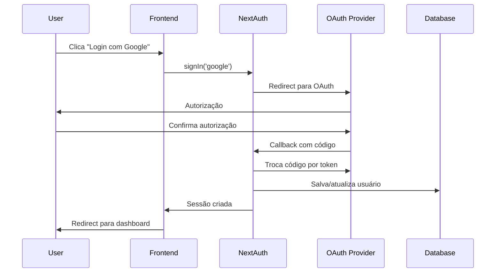
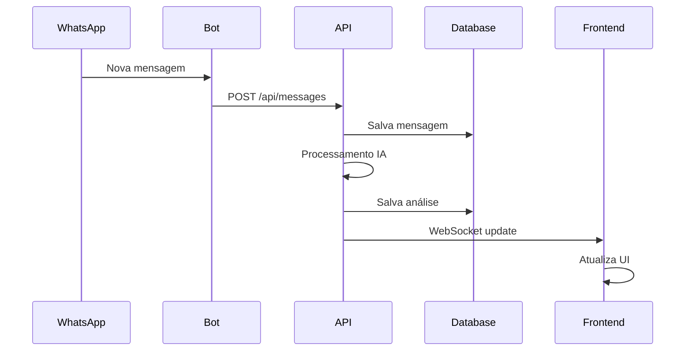
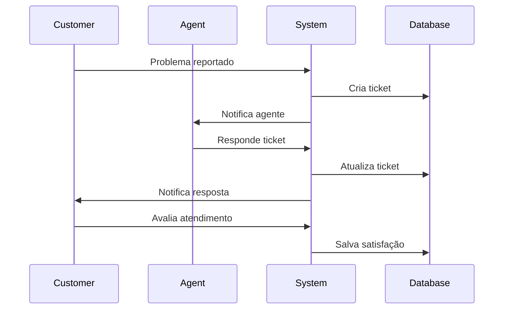

# Arquitetura do Sistema

Este documento descreve a arquitetura geral do WhatsApp Bot Dashboard, seus componentes principais, fluxos de dados e decisões de design.

## Visão Geral

O WhatsApp Bot Dashboard é uma aplicação web moderna construída com Next.js que permite gerenciar um bot do WhatsApp, clientes, tickets de suporte e campanhas de email marketing.

### Características Principais

- **Arquitetura Full-Stack**: Frontend e backend na mesma aplicação
- **Server-Side Rendering**: Renderização no servidor para melhor SEO
- **Real-time**: Atualizações em tempo real via WebSocket
- **API-First**: APIs RESTful bem definidas
- **Type-Safe**: TypeScript em todo o stack

## Arquitetura High-Level

```
┌─────────────────┐    ┌─────────────────┐    ┌─────────────────┐
│                 │    │                 │    │                 │
│   Frontend      │◄──►│   Backend       │◄──►│   Database      │
│   (Next.js)     │    │   (API Routes)  │    │   (SQLite/PG)   │
│                 │    │                 │    │                 │
└─────────────────┘    └─────────────────┘    └─────────────────┘
         │                       │                       │
         │                       │                       │
         ▼                       ▼                       ▼
┌─────────────────┐    ┌─────────────────┐    ┌─────────────────┐
│                 │    │                 │    │                 │
│   Authentication│    │   WhatsApp      │    │   External      │
│   (NextAuth.js) │    │   Integration   │    │   Services      │
│                 │    │                 │    │                 │
└─────────────────┘    └─────────────────┘    └─────────────────┘
```

## Camadas da Aplicação

### 1. Presentation Layer (Frontend)

**Tecnologias:**
- Next.js 14 (App Router)
- React 18
- TypeScript
- Tailwind CSS
- shadcn/ui

**Componentes:**
- **Pages**: Páginas da aplicação (`app/` directory)
- **Components**: Componentes reutilizáveis
- **Layouts**: Layouts compartilhados
- **Providers**: Provedores de contexto

**Estrutura:**
```
app/
├── (auth)/              # Grupo de autenticação
│   ├── login/
│   └── register/
├── dashboard/           # Área protegida
│   ├── layout.tsx      # Layout do dashboard
│   ├── page.tsx        # Dashboard principal
│   ├── customers/      # Gerenciamento de clientes
│   ├── tickets/        # Sistema de tickets
│   ├── messages/       # Mensagens WhatsApp
│   ├── analytics/      # Analytics e relatórios
│   └── settings/       # Configurações
├── api/                # API Routes
└── globals.css         # Estilos globais
```

### 2. Business Logic Layer (Backend)

**Tecnologias:**
- Next.js API Routes
- Prisma ORM
- NextAuth.js
- Zod (validação)

**Componentes:**
- **API Routes**: Endpoints REST
- **Middleware**: Autenticação e autorização
- **Services**: Lógica de negócio
- **Utils**: Utilitários compartilhados

**Estrutura:**
```
app/api/
├── auth/               # Autenticação (NextAuth.js)
├── customers/          # CRUD de clientes
├── tickets/            # Sistema de tickets
├── messages/           # Mensagens WhatsApp
├── bot/               # Controle do bot
├── analytics/         # Analytics
├── logs/              # Sistema de logs
└── webhooks/          # Webhooks externos

lib/
├── auth.ts            # Configuração NextAuth.js
├── prisma.ts          # Cliente Prisma
├── permissions.ts     # Sistema de permissões
├── security.ts        # Utilitários de segurança
├── analytics.ts       # Engine de analytics
└── ai-processor.ts    # Processamento IA
```

### 3. Data Access Layer

**Tecnologias:**
- Prisma ORM
- SQLite (desenvolvimento)
- PostgreSQL (produção)

**Modelos Principais:**
```prisma
User           # Usuários do sistema
Customer       # Clientes WhatsApp
Ticket         # Tickets de suporte
Message        # Mensagens WhatsApp
EmailTemplate  # Templates de email
EmailCampaign  # Campanhas de email
Log            # Logs do sistema
BotConfig      # Configurações do bot
```

### 4. External Integrations

**WhatsApp Integration:**
- WhatsApp Web API
- Puppeteer para automação
- WebSocket para eventos em tempo real

**OAuth Providers:**
- Google OAuth 2.0
- GitHub OAuth

**Email Services:**
- SMTP (Gmail, SendGrid, etc.)
- Templates HTML

## Fluxos de Dados

### 1. Fluxo de Autenticação



### 2. Fluxo de Mensagem WhatsApp



### 3. Fluxo de Ticket



## Padrões de Design

### 1. Repository Pattern

```typescript
// Abstração do acesso a dados
interface CustomerRepository {
  findMany(filters: CustomerFilters): Promise<Customer[]>
  findById(id: string): Promise<Customer | null>
  create(data: CreateCustomerData): Promise<Customer>
  update(id: string, data: UpdateCustomerData): Promise<Customer>
  delete(id: string): Promise<void>
}

// Implementação com Prisma
class PrismaCustomerRepository implements CustomerRepository {
  async findMany(filters: CustomerFilters) {
    return prisma.customer.findMany({
      where: this.buildWhereClause(filters),
      include: this.getDefaultIncludes(),
    })
  }
  // ... outras implementações
}
```

### 2. Service Layer Pattern

```typescript
// Lógica de negócio encapsulada
class TicketService {
  constructor(
    private ticketRepo: TicketRepository,
    private notificationService: NotificationService,
    private slaService: SLAService
  ) {}

  async createTicket(data: CreateTicketData): Promise<Ticket> {
    const ticket = await this.ticketRepo.create(data)
    
    // Aplicar SLA
    await this.slaService.assignSLA(ticket)
    
    // Notificar agente
    await this.notificationService.notifyAssignment(ticket)
    
    return ticket
  }
}
```

### 3. Factory Pattern

```typescript
// Factory para criar diferentes tipos de notificação
class NotificationFactory {
  static create(type: NotificationType): NotificationProvider {
    switch (type) {
      case 'email':
        return new EmailNotificationProvider()
      case 'sms':
        return new SMSNotificationProvider()
      case 'push':
        return new PushNotificationProvider()
      default:
        throw new Error(`Unknown notification type: ${type}`)
    }
  }
}
```

### 4. Observer Pattern

```typescript
// Sistema de eventos para atualizações em tempo real
class EventEmitter {
  private listeners: Map<string, Function[]> = new Map()

  on(event: string, callback: Function) {
    if (!this.listeners.has(event)) {
      this.listeners.set(event, [])
    }
    this.listeners.get(event)!.push(callback)
  }

  emit(event: string, data: any) {
    const callbacks = this.listeners.get(event) || []
    callbacks.forEach(callback => callback(data))
  }
}

// Uso
const eventBus = new EventEmitter()

eventBus.on('message.received', (message) => {
  // Atualizar UI
  // Processar com IA
  // Criar ticket se necessário
})
```

## Segurança

### 1. Autenticação e Autorização

```typescript
// Middleware de autenticação
export async function authMiddleware(req: NextRequest) {
  const session = await getServerSession(authOptions)
  
  if (!session) {
    return NextResponse.redirect('/login')
  }
  
  return NextResponse.next()
}

// Verificação de permissões
export function requirePermission(permission: string) {
  return (req: NextRequest) => {
    const user = getCurrentUser(req)
    
    if (!hasPermission(user.permissions, permission)) {
      return NextResponse.json({ error: 'Forbidden' }, { status: 403 })
    }
  }
}
```

### 2. Validação de Dados

```typescript
// Schema de validação com Zod
const createCustomerSchema = z.object({
  name: z.string().min(1, 'Nome é obrigatório'),
  phone: z.string().regex(/^\+\d{10,15}$/, 'Telefone inválido'),
  email: z.string().email('Email inválido').optional(),
})

// Uso em API route
export async function POST(request: NextRequest) {
  try {
    const body = await request.json()
    const validatedData = createCustomerSchema.parse(body)
    // ... resto da lógica
  } catch (error) {
    if (error instanceof z.ZodError) {
      return NextResponse.json({ errors: error.errors }, { status: 400 })
    }
  }
}
```

### 3. Rate Limiting

```typescript
// Rate limiting simples
class RateLimiter {
  private requests: Map<string, number[]> = new Map()

  isAllowed(key: string, limit: number, windowMs: number): boolean {
    const now = Date.now()
    const requests = this.requests.get(key) || []
    
    // Remove requests antigas
    const validRequests = requests.filter(time => now - time < windowMs)
    
    if (validRequests.length >= limit) {
      return false
    }
    
    validRequests.push(now)
    this.requests.set(key, validRequests)
    return true
  }
}
```

## Performance

### 1. Caching Strategy

```typescript
// Cache em memória para dados frequentes
class CacheManager {
  private cache: Map<string, { data: any; expiry: number }> = new Map()

  set(key: string, data: any, ttlMs: number) {
    this.cache.set(key, {
      data,
      expiry: Date.now() + ttlMs
    })
  }

  get(key: string) {
    const item = this.cache.get(key)
    
    if (!item || Date.now() > item.expiry) {
      this.cache.delete(key)
      return null
    }
    
    return item.data
  }
}

// Uso
const cache = new CacheManager()

export async function getCustomerStats() {
  const cacheKey = 'customer-stats'
  let stats = cache.get(cacheKey)
  
  if (!stats) {
    stats = await calculateCustomerStats()
    cache.set(cacheKey, stats, 5 * 60 * 1000) // 5 minutos
  }
  
  return stats
}
```

### 2. Database Optimization

```typescript
// Queries otimizadas
export async function getCustomersWithMessages() {
  return prisma.customer.findMany({
    select: {
      id: true,
      name: true,
      phone: true,
      status: true,
      _count: {
        select: {
          messages: true
        }
      }
    },
    orderBy: {
      lastMessage: 'desc'
    },
    take: 50 // Limitar resultados
  })
}

// Índices importantes
model Customer {
  // ... campos
  @@index([status, lastMessage])
  @@index([phone])
}
```

### 3. Lazy Loading

```typescript
// Lazy loading de componentes
const AdvancedAnalytics = dynamic(
  () => import('@/components/advanced/advanced-analytics'),
  {
    loading: () => <AnalyticsSkeleton />,
    ssr: false
  }
)

// Lazy loading de dados
export function useCustomers() {
  const [customers, setCustomers] = useState<Customer[]>([])
  const [loading, setLoading] = useState(false)

  const loadMore = async () => {
    setLoading(true)
    const newCustomers = await fetchCustomers(customers.length)
    setCustomers(prev => [...prev, ...newCustomers])
    setLoading(false)
  }

  return { customers, loading, loadMore }
}
```

## Monitoramento

### 1. Logging

```typescript
// Sistema de logs estruturado
enum LogLevel {
  DEBUG = 'debug',
  INFO = 'info',
  WARN = 'warn',
  ERROR = 'error'
}

class Logger {
  static log(level: LogLevel, message: string, context?: any) {
    const logEntry = {
      timestamp: new Date().toISOString(),
      level,
      message,
      context,
      service: 'whatsapp-dashboard'
    }

    // Salvar no banco
    prisma.log.create({ data: logEntry })

    // Console em desenvolvimento
    if (process.env.NODE_ENV === 'development') {
      console.log(JSON.stringify(logEntry, null, 2))
    }
  }

  static info(message: string, context?: any) {
    this.log(LogLevel.INFO, message, context)
  }

  static error(message: string, error?: Error) {
    this.log(LogLevel.ERROR, message, {
      error: error?.message,
      stack: error?.stack
    })
  }
}
```

### 2. Métricas

```typescript
// Coleta de métricas
class MetricsCollector {
  static async recordAPICall(endpoint: string, method: string, duration: number, status: number) {
    await prisma.metric.create({
      data: {
        type: 'api_call',
        endpoint,
        method,
        duration,
        status,
        timestamp: new Date()
      }
    })
  }

  static async recordUserAction(userId: string, action: string) {
    await prisma.metric.create({
      data: {
        type: 'user_action',
        userId,
        action,
        timestamp: new Date()
      }
    })
  }
}
```

### 3. Health Checks

```typescript
// Health check da aplicação
export async function GET() {
  const checks = await Promise.allSettled([
    // Database
    prisma.$queryRaw`SELECT 1`,
    
    // External API
    fetch('https://api.whatsapp.com/health'),
    
    // Bot status
    checkBotStatus(),
  ])

  const status = checks.every(check => check.status === 'fulfilled') 
    ? 'healthy' 
    : 'unhealthy'

  return NextResponse.json({
    status,
    timestamp: new Date().toISOString(),
    checks: checks.map((check, i) => ({
      name: ['database', 'whatsapp_api', 'bot'][i],
      status: check.status
    }))
  })
}
```

## Escalabilidade

### 1. Horizontal Scaling

- **Stateless Design**: Aplicação sem estado para facilitar scaling
- **Database Connection Pooling**: Pool de conexões otimizado
- **CDN**: Assets estáticos servidos via CDN
- **Load Balancer**: Distribuição de carga entre instâncias

### 2. Vertical Scaling

- **Code Splitting**: Divisão do bundle para carregamento otimizado
- **Image Optimization**: Otimização automática de imagens
- **Database Indexing**: Índices otimizados para queries frequentes
- **Caching**: Multiple layers de cache

### 3. Future Considerations

- **Microservices**: Separação em serviços menores
- **Message Queue**: Processamento assíncrono
- **Kubernetes**: Orquestração de containers
- **Database Sharding**: Distribuição de dados

## Conclusão

A arquitetura do WhatsApp Bot Dashboard foi projetada para ser:

- **Escalável**: Capaz de crescer com as necessidades
- **Manutenível**: Código organizado e bem documentado
- **Segura**: Múltiplas camadas de segurança
- **Performante**: Otimizada para velocidade
- **Extensível**: Fácil de adicionar novas funcionalidades

Esta arquitetura fornece uma base sólida para o crescimento e evolução contínua do sistema.
